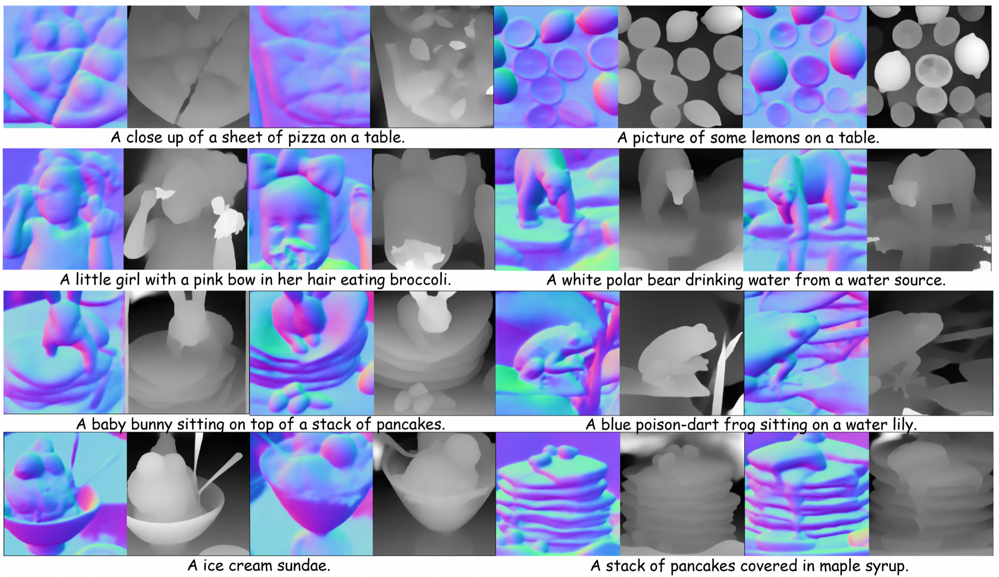
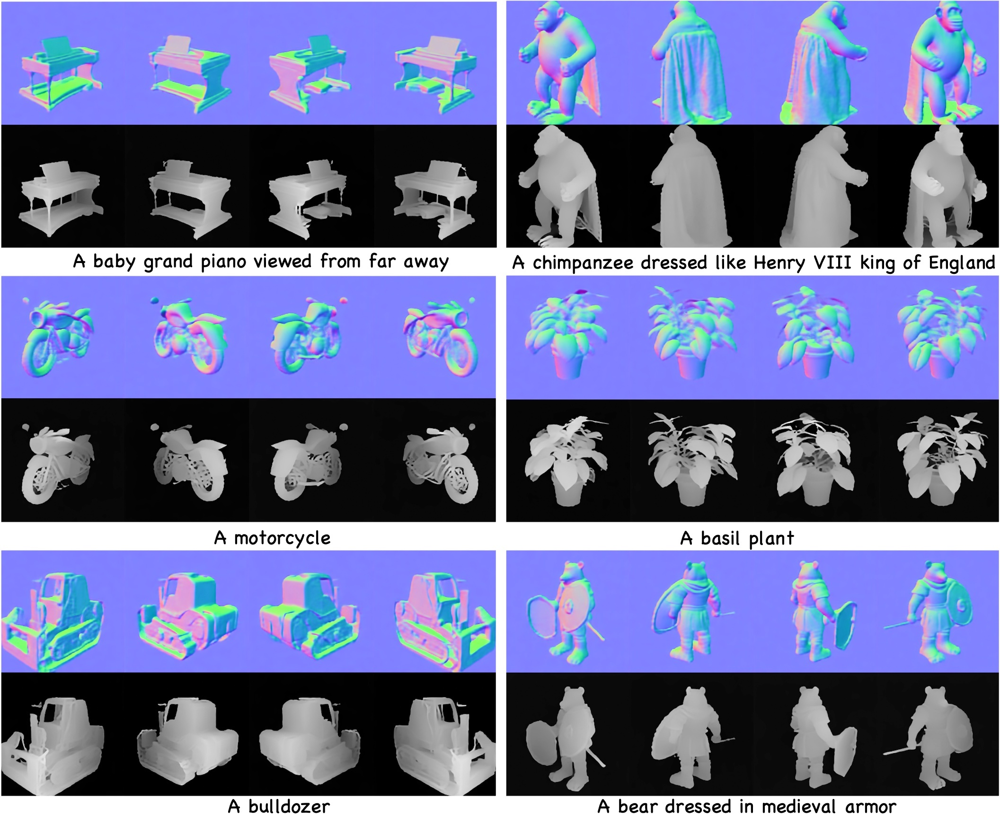

# Normal-Depth Diffusion Model
RichDreamer: A Generalizable Normal-Depth Diffusion Model for Detail Richness in Text-to-3D

Text-to-ND



Text-to-ND-MV



## [Project page](https://lingtengqiu.github.io/RichDreamer/) | [Paper](https://arxiv.org/abs/2311.16918) | [YouTube](https://youtu.be/6gQ1VWiKoc0)

- [x] Inference code.
- [x] Training code.
- [x] Pretrained model: ND, ND-MV, Albedo-MV.
- [ ] Pretrained model: ND-MV-VAE.
- [ ] Rendered Multi-View Image of Objaverse-dataset.

### News
- 2023-12-11: Inference codes and pretrained models are released.


## Preparation for inference
1. Install requirements using following scripts. 
```bash
conda create -n nd
conda activate md
pip install -r requirements.txt
pip install git+https://github.com/openai/CLIP.git
pip install git+https://github.com/CompVis/taming-transformers.git
pip install webdataset
pip install img2dataset
```
we also provide a dockerfile to build docker image.
```bash
sudo docker build -t mv3dengine_22.04:cu118 -f docker/Dockerfile .
```

2. Download pretrained weights.
- [ND](https://virutalbuy-public.oss-cn-hangzhou.aliyuncs.com/share/RichDreamer/nd-laion_ema.ckpt): Normal-Depth Diffusion trained on Laion-2B
- [ND-MV](https://virutalbuy-public.oss-cn-hangzhou.aliyuncs.com/share/RichDreamer/nd_mv_ema.ckpt): MultiView Normal-Depth Diffusion Model
- [Alebdo-MV](https://virutalbuy-public.oss-cn-hangzhou.aliyuncs.com/share/RichDreamer/albedo_mv_ema.ckpt): MultiView Depth-conditioned Albedo Diffusion Model

we also provide a script for download.
```bash
python tools/download_models/download_nd_models.py
```

## Inference (Sampling)
we provide a script for sampling
```bash
python demo_inference.sh
```
Or use the following detailed instructions:

### Text2ND sampling
```
# dmp solver
python ./scripts/t2i.py --ckpt $ckpt_path --prompt $prompt --dpm_solver --n_samples 2 --save_dir $save_dir
# plms solver
python ./scripts/t2i.py --ckpt $ckpt_path --prompt $prompt --plms --n_samples 2  --save_dir $save_dir
# ddim solver
python ./scripts/t2i.py --ckpt $ckpt_path --prompt $prompt --n_samples 2  --save_dir $save_dir
```

### Text2ND-MV sampling
```
# nd-mv
python ./scripts/t2i_mv.py --ckpt_path $ckpt_path --prompt $prompt  --num_frames 4  --model_name nd-mv --save_dir $save_dir

# nd-mv with VAE (coming soon)
python ./scripts/t2i_mv.py --ckpt_path $ckpt_path --prompt $prompt  --num_frames 4  --model_name nd-mv-vae --save_dir $save_dir

```

### Text2Albedo-MV sampling
```
python ./scripts/td2i_mv.py --ckpt_path $ckpt_path --prompt $prompt --depth_file $ depth_file --num_frames 4  --model_name albedo-mv --save_dir $save_dir

```


## Preparation for training

1. Download Laion-2B-en-5-AES (*Required to train ND model*)

Download laion-2b dataset from [parquet](https://huggingface.co/datasets/laion/laion2B-en)
Then, put parquet files into  ```./laion2b-dataset-5-aes```
```bash
cd ./tools/download_dataset
bash ./download_2b-5_aes.sh
cd -
```

2. Download Monocular Video Weights (*Required to train ND model*)
- NormalBae [scannet.pt](#)
- Midas3.1 [dpt_beit_large512.pt](#)

```bash
# move the scannet.pt to normalbae Prior Model
mv scannet.pt ./libs/ControlNet-v1-1-nightly/annotator/normalbae/scannet.pt
# move the dpt_beit_large512.pt to ./libs/omnidata_torch/pretrained_models/dpt_beit_large_512.pt
mv dpt_beit_large512.pt ./libs/omnidata_torch/pretrained_models/dpt_beit_large_512.pt
```

3. Download rendered Multi-View image of Objaverse-dataset (*Required to train ND-MV and Albedo-MV model*)
- Download our rendered dataset using a shared [link](#)

```bash
ln -s /path/to/objaverse_dataset mvs_objaverse
```

## Training
### Training Normal-Depth-VAE Model
1. Download [pretrained-VAE weights](xx) pretrained on ImageNet.
2. Modify the config file in `configs/autoencoder_normal_depth/autoencoder_normal_depth.yaml`, set `model.ckpt_path=/path/to/pretained-VAE weights`

```bash
# training  VAE datasets
bash ./scripts/train_vae/train_nd_vae/train_rgbd_vae_webdatasets.sh \ model.ckpt_path=${pretained-VAE weights} \
data.params.train.params.curls='path_laion/{00000..${:5 id}.tar' \
--gpus 0,1,2,3,4,5,6,7
```

### Training Normal-Depth-Diffusion Model
After training and get `Normal-Depth-VAE` Model or you could download it from [ND-VAE](#)

```bash
# step 1
export SD-MODEL-PATH=/path/to/sd-1.5
bash scripts/train_normald_sd/txt_cond/web_datasets/train_normald_webdatasets.sh --gpus 0,1,2,3,4,5,6,7 \
    model.params.first_stage_ckpts=${Normal-Depth-VAE} model.params.ckpt_path=${SD-MODEL-PATH} \
    data.params.train.params.curls='path_laion/{00000..${:5 id}.tar'

# step 2 modify your step_weights path in ./configs/stable-diffusion/normald/sd_1_5/txt_cond/web_datasets/laion_2b_step2.yaml
bash scripts/train_normald_sd/txt_cond/web_datasets/train_normald_webdatasets_step2.sh --gpus 0,1,2,3,4,5,6,7 \
    model.params.first_stage_ckpts=${Normal-Depth-VAE} \
    model.params.ckpt_path=${pretrained-step-weights} \
    data.params.train.params.curls='path_laion/{00000..${:5 id}.tar'
```

### Training MultiView-Normal-Depth-Diffusion Model
After training and get `Normal-Depth-Diffusion` Model or you could download it from [ND](https://virutalbuy-public.oss-cn-hangzhou.aliyuncs.com/share/RichDreamer/nd-laion_ema.ckpt),

We provide two versions of MultiView-Normal-Depth Diffusion Model

a. without VAE Denoise
b. with VAE Denoise

In current version, we provide w/o VAE denoise

```bash
# a. Training Without VAE version
bash ./scripts/train_normald_sd/txt_cond/objaverse/objaverse_finetune_wovae_mvsd-4.sh --gpus 0,1,2,3,4,5,6,7,  \
    model.params.ckpt_path=${Normal-Depth-Diffusion}
# b. Training with VAE version
bash ./scripts/train_normald_sd/txt_cond/objaverse/objaverse_finetune_mvsd-4.sh --gpus 0,1,2,3,4,5,6,7, \
    model.params.ckpt_path=${Normal-Depth-Diffusion}

```

### Training MultiView-Depth-Conditioned-Albedo-Diffusion Model
After training and get `Normal-Depth-Diffusion` Model or you could download it from [ND](https://virutalbuy-public.oss-cn-hangzhou.aliyuncs.com/share/RichDreamer/nd-laion_ema.ckpt),

```bash
bash scripts/train_abledo/objaverse/objaverse_finetune_mvsd-4.sh --gpus 0,1,2,3,4,5,6,7, model.params.ckpt_path=${Normal-Depth-Diffusion}
```

## Acknowledgement
We have intensively borrow codes from the following repositories. Many thanks to the authors for sharing their codes.
- [stable diffusion](https://github.com/CompVis/stable-diffusion)
- [mvdream](https://github.com/bytedance/MVDream)

## Citation	

```
@article{qiu2023richdreamer,
    title={RichDreamer: A Generalizable Normal-Depth Diffusion Model for Detail Richness in Text-to-3D}, 
    author={Lingteng Qiu and Guanying Chen and Xiaodong Gu and Qi zuo and Mutian Xu and Yushuang Wu and Weihao Yuan and Zilong Dong and Liefeng Bo and Xiaoguang Han},
    year={2023},
    journal = {arXiv preprint arXiv:2311.16918}
}
```

